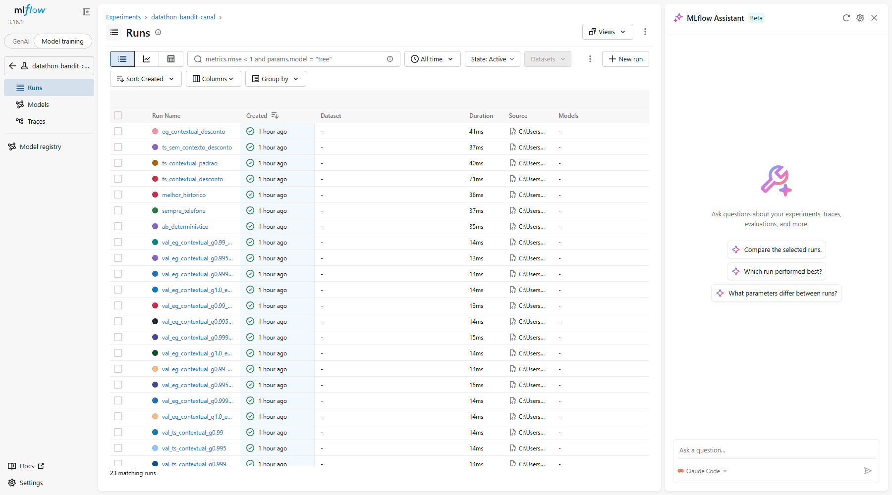

# Datathon MLET — Bandit contextual para escolha de canal de contato

**Problema:** uma instituição financeira decide hoje por regra fixa / teste A/B qual canal (celular ou telefone fixo) usar para oferecer um depósito a prazo, o que desperdiça tráfego no canal pior e reage devagar a mudanças de comportamento. **Solução:** um Thompson Sampling contextual com esquecimento (`γ`) mantém uma posterior Beta por segmento de cliente × canal e escolhe o canal a cada contato, aprendendo continuamente com o resultado observado. **Resultado principal (honesto):** no teste (30 seeds, IC 95% por bootstrap de blocos), a política servida (`ts_contextual_desconto`) teve SNIPS de 20,71% vs. 20,02% do baseline A/B — **+0,69 p.p., IC 95% [−0,57; +3,15] p.p.** —, ou seja, o critério de sucesso pré-registrado (superar o baseline com significância) **não foi atingido**; a versão sem contexto do mesmo mecanismo (`ts_sem_contexto_desconto`) supera o baseline com significância (+1,86 p.p., IC [+0,31; +5,20] p.p.) — indício de que o esquecimento ajuda e de que, neste volume de dados, segmentar em 6 contextos custa mais variância do que ganha em personalização; nenhuma política supera a regra fixa `melhor_historico` ("sempre celular"), escolhida com o 1º mês de avaliação e que, neste dataset, quase não deixa de ser o melhor canal (ver [§6](#6-resultados)).

---

## Sumário

- [Datathon MLET — Bandit contextual para escolha de canal de contato](#datathon-mlet--bandit-contextual-para-escolha-de-canal-de-contato)
  - [Sumário](#sumário)
  - [1. Problema de negócio](#1-problema-de-negócio)
  - [2. Dataset](#2-dataset)
    - [Colunas e leakage](#colunas-e-leakage)
    - [Limitações do dataset](#limitações-do-dataset)
  - [3. Governança e LGPD](#3-governança-e-lgpd)
  - [4. EDA](#4-eda)
  - [5. Metodologia](#5-metodologia)
  - [6. Resultados](#6-resultados)
    - [Interpretação honesta](#interpretação-honesta)
  - [7. Golden Set](#7-golden-set)
  - [8. Arquitetura local](#8-arquitetura-local)
    - [Decisões de componentes (ADR resumido)](#decisões-de-componentes-adr-resumido)
  - [9. Arquitetura-alvo na nuvem (AWS)](#9-arquitetura-alvo-na-nuvem-aws)
  - [10. MLflow](#10-mlflow)
  - [11. API](#11-api)
  - [12. Docker](#12-docker)
    - [Monitoramento com Prometheus](#monitoramento-com-prometheus)
  - [13. Testes](#13-testes)
    - [Integração contínua (GitHub Actions)](#integração-contínua-github-actions)
  - [14. Como executar (passo a passo)](#14-como-executar-passo-a-passo)
  - [15. Estrutura do repositório](#15-estrutura-do-repositório)
  - [16. Roteiro do vídeo (até 5 min)](#16-roteiro-do-vídeo-até-5-min)
  - [17. Limitações](#17-limitações)
  - [18. Checklist de entrega](#18-checklist-de-entrega)

---

## 1. Problema de negócio

Uma instituição financeira digital precisa decidir, para cada cliente elegível de uma campanha de depósito a prazo, **por qual canal fazer a oferta**: celular ou telefone fixo. Hoje essa alocação é feita por regra fixa ou teste A/B 50/50, o que tem dois custos:

- **Desperdício de tráfego**: metade dos contatos continua indo para o canal pior mesmo depois de já se saber (estatisticamente) qual converte mais.
- **Lentidão para reagir**: uma regra fixa, calibrada uma vez, não se adapta quando o comportamento dos clientes muda ao longo da campanha (sazonalidade, público-alvo, discurso da equipe de vendas).

A proposta é tratar a escolha de canal como um **bandit contextual**: a cada cliente, o sistema observa um contexto disponível antes do contato (faixa etária e sucesso em campanha anterior), escolhe um canal, observa a conversão e atualiza sua crença sobre qual canal funciona melhor para aquele contexto — concentrando tráfego no canal historicamente melhor sem deixar de testar o outro, e com uma memória que **esquece o passado distante** para acompanhar mudanças.

## 2. Dataset

- **Fonte:** [Kaggle — `henriqueyamahata/bank-marketing`](https://www.kaggle.com/datasets/henriqueyamahata/bank-marketing), publicado originalmente no [UCI Machine Learning Repository](https://archive.ics.uci.edu/dataset/222/bank+marketing) (Moro, Cortez & Rita, 2014), licença **CC BY 4.0**.
- **Arquivo:** `bank-additional-full.csv` (`;` como separador), versionado em `data/raw/` (~5,8 MB) para reprodutibilidade sem credenciais do Kaggle. Hash de integridade: `sha256:74adfc578bf77a7ff4bb1ba4a9f8709d9e3c6907342959c2c8416847e0afb4d8` (calculado por `datathon.data.dataset_sha256`, registrado em todo experimento).
- **Tamanho:** 41.188 linhas × 20 features + alvo `y`; após remover 12 duplicatas exatas (`keep="first"`), **41.176 linhas**. Registros em ordem cronológica (mai/2008 a nov/2010).
- **Alvo (`reward`):** 1 se o cliente contratou o depósito a prazo (`y == "yes"`), 0 caso contrário. Conversão global ≈11,3%.
- **Braço (ação):** coluna `contact` (`cellular` ou `telephone`) — é a decisão que o sistema toma, nunca usada como feature de contexto.
- **Contexto (segmento):** `age` e `poutcome` — as duas variáveis disponíveis antes do contato com maior poder discriminante sobre a conversão (ver [EDA](#4-eda)).

### Colunas e leakage

| Coluna | Decisão | Motivo |
|---|---|---|
| `duration` | **Removida** | Duração da chamada só é conhecida **depois** dela acontecer (exigência explícita do enunciado do desafio); prevê o alvo por construção |
| `campaign` | **Removida** | Conta o número de contatos **incluindo o contato atual** — informação posterior à própria decisão |
| `contact` | Usada como **braço**, não como feature | É a ação decidida pelo sistema |
| `age`, `poutcome` | Usadas no **segmento** (contexto) | Disponíveis antes do contato; maiores diferenças de conversão observadas na EDA |
| `pdays`, `previous`, demais atributos socioeconômicos | Mantidos no dataset limpo, não usados no segmento | Simplicidade do escopo; documentado como possível extensão |
| `y` | Alvo → `reward` (0/1) | — |

### Limitações do dataset

- Dados de **2008–2010, Portugal** — não representam o comportamento de clientes atuais nem outro mercado.
- Um único produto (depósito a prazo); a decisão modelada é apenas o canal, não o produto ofertado.
- Os cortes de faixa etária e a própria escolha de `age × poutcome` como segmento vieram da EDA sobre **a base inteira** (incluindo o que se tornaria o conjunto de teste) — um leve *data snooping* na definição da segmentação, aceito por simplicidade e registrado como limitação (ver [§17](#17-limitações)).

## 3. Governança e LGPD

- **Natureza dos dados:** base pública, histórica e já anonimizada — não há nome, CPF, telefone, e-mail ou qualquer identificador direto de cliente; os "clientes" do Golden Set (§7) são fictícios.
- **Base legal:** por serem dados públicos e anonimizados (CC BY 4.0, §2), este dataset está fora do escopo de dados pessoais identificáveis tratado pela LGPD. Numa operação real com dados de clientes reais, a base legal para o uso em campanha de marketing seria o **legítimo interesse** (art. 7º, IX) ou o **consentimento** (art. 7º, I), sempre com opção de **opt-out** do cliente.
- **Finalidade:** apoiar a decisão de **canal de contato** de uma campanha de marketing já aprovada, não decidir se o cliente deve ou não ser contatado, nem seu score de crédito.
- **Minimização de dados:** apenas **duas variáveis** entram na decisão do modelo — idade (faixa etária) e resultado de campanha anterior (`poutcome`). Nenhum dado socioeconômico, de crédito ou demográfico sensível (gênero, raça, religião) é usado como feature.
- **Retenção:** o artefato servido (`models/policy.json`) guarda apenas contadores agregados (`alpha`/`beta` por segmento × canal), nunca registros individuais de cliente; o dataset bruto usado no treino é público.
- **Risco de viés etário:** a idade entra diretamente na segmentação, o que pode levar o modelo a tratar sistematicamente clientes idosos de forma diferente (ex.: segmento `senior_com_sucesso`, onde a amostra é pequena e a recomendação de canal é incerta — ver Golden Set, cliente 5). Por isso a API expõe `prob_cellular_better`, permitindo que um humano identifique e revise decisões de baixa confiança.
- **Humano no loop:** para decisões sensíveis (baixa confiança, amostra pequena por segmento, ou reclamação de cliente), a recomendação do modelo deve ser tratada como **sugestão**, revisável por um analista de campanha antes do disparo — o sistema não substitui esse julgamento, apenas o informa.

## 4. EDA

Achados completos e código em [`notebooks/01_eda.ipynb`](notebooks/01_eda.ipynb):

- A base é **desbalanceada**: apenas ≈11,3% dos contatos resultam em conversão.
- O canal **celular** converte quase 3× mais que o **telefone** na base agregada (≈14,7% vs. ≈5,2%), mas essa comparação bruta mistura contexto do cliente e período da campanha.
- O celular converte mais em quase todos os segmentos de idade × sucesso anterior. A única exceção é **≥60 anos com sucesso anterior**, onde o telefone aparenta converter mais (84,6% vs. 75,4%) — mas com amostra muito pequena (telefone `n=13`), insuficiente para uma conclusão robusta.
- Ter sido bem-sucedido em campanha anterior (`poutcome == "success"`) é o sinal mais forte de conversão (≈65,1%, contra ≈8,8% sem contato anterior) — por isso, junto com a idade, define o segmento do bandit.
- **Confusão temporal forte:** nos dois primeiros blocos (mai–jun/2008) o contato foi exclusivamente por telefone e a conversão ficou em 3–4%; nos últimos blocos (2010) a conversão sobe para 45–57%, período em que o celular já domina os contatos. Comparar canais sem controlar o tempo é enganoso — a diferença celular vs. telefone observada acima é parcialmente efeito de período, não só de canal. Isso motiva a avaliação por blocos temporais com propensão logada (§5).
- A conversão sobe monotonicamente com `duration` (de ≈0,5% no quintil mais curto a ≈33,0% no mais longo) — confirmação de que essa coluna teria de ser removida por leakage.

## 5. Metodologia

Código em [`src/datathon/`](src/datathon/); detalhes de formulação em [`docs/superpowers/specs/2026-09-24-datathon-bandit-design.md`](docs/superpowers/specs/2026-09-24-datathon-bandit-design.md).

- **Braços:** `cellular` (índice 0), `telephone` (índice 1).
- **Contexto (6 segmentos):** faixa etária (`jovem` ≤30, `adulto` 31–59, `senior` ≥60) × sucesso em campanha anterior (`poutcome == "success"`): `jovem_sem_sucesso`, `jovem_com_sucesso`, `adulto_sem_sucesso`, `adulto_com_sucesso`, `senior_sem_sucesso`, `senior_com_sucesso`. Uma única função `segment_of` (`features.py`) é usada no treino, na avaliação e na API.
- **Recompensa:** binária, 1 se `y == "yes"`.
- **Thompson Sampling com esquecimento (`DiscountedThompsonSampling`):** mantém contagens de sucesso/fracasso por segmento × braço, com posterior `Beta(1 + S, 1 + F)` (prior `Beta(1,1)` explícito). A cada atualização, as contagens **do segmento observado** são multiplicadas por `γ ∈ (0,1]` antes de somar o novo evento — uma memória efetiva de ≈`1/(1−γ)` eventos por segmento, que evita ficar "preso" a estimativas antigas quando a base não é estacionária. `γ = 1` recupera o TS padrão (sem esquecimento) — usado como ablação.
- **ε-Greedy com esquecimento:** mesmas contagens com desconto `γ`; com probabilidade `ε` escolhe um braço uniformemente ao acaso, senão o de maior média posterior — comparação mais simples de exploração/explotação.
- **Baselines:** `ab_deterministico` (alterna os dois canais evento a evento, 50/50 — o "teste A/B" que a área já faria), `sempre_telefone` (regra fixa ingênua) e `melhor_historico` (canal de maior conversão no **primeiro bloco de avaliação** — jul/2008 — fixo depois; não é retrospectivo: essa conversão é observável antes mesmo do início do teste em nov/2008, então é uma regra fixa que já poderia ser aplicada em tempo real, um dos baselines sugeridos pelo enunciado do desafio, "melhor braço histórico").
- **Avaliação por replay off-policy com SNIPS:** cada evento é aproveitado só quando a política escolheria o mesmo canal do log (`matched`); a conversão é estimada por *Self-Normalized Inverse Propensity Scoring* — pondera cada evento pelo inverso da propensão logada do canal naquele **bloco temporal** (mês) e normaliza pela soma dos pesos.
- **Por que não o replay ingênuo:** usar a média bruta dos eventos `matched` enviesa o resultado, porque o canal menos usado no log tende a aparecer concentrado em blocos/condições diferentes do canal majoritário (ex.: telefone predominando nos meses de conversão baixa). SNIPS corrige esse viés de propensão; a comparação entre os dois métodos está no notebook 02.
- **Split temporal:** eventos de avaliação (blocos onde os dois canais aparecem, 29.040 eventos) divididos cronologicamente ao meio — primeira metade = **validação** (escolha de `γ ∈ {1; 0,999; 0,995; 0,99}` e `ε ∈ {0,05; 0,1; 0,2}` pela métrica principal, 10 seeds), segunda metade = **teste** (14.520 eventos, métricas finais reportadas com 30 seeds e IC 95% por bootstrap de blocos, 1.000 reamostragens). Hiperparâmetros nunca são ajustados olhando o teste.

## 6. Resultados

Todos os números vêm de [`reports/metrics.json`](reports/metrics.json), gerado por `python -m datathon.train` (30 seeds de teste, 10 de validação, bootstrap por blocos). Figura: [`reports/figures/conversao_snips.png`](reports/figures/conversao_snips.png) (ver também `pseudo_regret.png` e `escolha_melhor_braco.png`).

| Política | SNIPS teste (méd. ± dp) | Dif. vs. baseline | IC 95% da dif. | Pseudo-regret final | % no melhor braço |
|---|---:|---:|---:|---:|---:|
| A/B determinístico (**baseline**) | 20,02% ± 0,00 | — | — | 749,5 | 50,0% |
| Sempre telefone | 15,02% ± 0,00 | −4,99 p.p. | [−9,89; −3,03] p.p. | 1.411,7 | 8,3% |
| Melhor histórico (sempre celular, regra fixa desde jul/2008) | 24,40% ± 0,00 | +4,38 p.p. | [+2,05; +8,99] p.p. | 87,6 | 91,7% |
| **TS contextual com esquecimento (servido)** | **20,71% ± 0,53** | **+0,69 p.p.** | **[−0,57; +3,15] p.p.** | 614,3 | 49,4% |
| TS contextual padrão (γ=1, ablação) | 19,96% ± 1,89 | −0,07 p.p. | [−1,39; +1,02] p.p. | 735,6 | 46,0% |
| TS sem contexto c/ esquecimento (ablação) | 21,87% ± 0,36 | +1,86 p.p. | [+0,31; +5,20] p.p. | 475,8 | 55,8% |
| ε-Greedy contextual c/ esquecimento | 18,38% ± 1,26 | −1,65 p.p. | [−2,71; −0,65] p.p. | 909,8 | 29,7% |

Hiperparâmetros escolhidos na validação (métrica: SNIPS): `γ_TS = 0,99`, `ε_EG = 0,1`, `γ_EG = 0,999`.

### Interpretação honesta

O **critério de sucesso pré-registrado** — a política servida superar o A/B determinístico com IC 95% acima de zero — **não foi atingido**: +0,69 p.p., IC [−0,57; +3,15] p.p. inclui zero. Isso é reportado como saiu, sem ajustar a política depois de olhar o teste.

Isso não significa que o mecanismo de bandit não funcione:

1. **A ablação sem contexto** (`ts_sem_contexto_desconto` — mesmo esquecimento, um único "segmento" para toda a base) **supera o baseline com significância estatística** (+1,86 p.p., IC [+0,31; +5,20] p.p.). Ou seja, o mecanismo adaptativo (Thompson Sampling com esquecimento) bate a regra fixa quando não precisa dividir os dados em 6 segmentos.
2. **O contexto ainda não compensa, neste volume de dados**: dividir os ≈14.520 eventos de teste em 6 segmentos reduz a quantidade de dados por segmento e aumenta a variância da estimativa mais do que o ganho de personalização compensa nesta escala — um trade-off clássico entre personalização e dados disponíveis por segmento. O ganho de contexto pode aparecer com mais tráfego histórico.
3. **Há indício (não prova estatística) de que o esquecimento ajuda**: a estimativa pontual de `ts_contextual_desconto` (`γ=0,99`) é maior que a de `ts_contextual_padrao` (`γ=1`) — mas os IC 95% de ambas cruzam zero (`γ=0,99`: +0,69 p.p., IC [−0,57; +3,15] p.p.; `γ=1`: −0,07 p.p., IC [−1,39; +1,02] p.p.) e a diferença entre as duas não foi testada diretamente. É consistente com a hipótese de que a base não é estacionária e de que descontar observações antigas ajuda o bandit contextual a acompanhar mudanças ao longo da campanha, mas os dados atuais não permitem afirmar isso com confiança estatística.
4. **Ninguém supera `melhor_historico`** (sempre celular, 24,40% de SNIPS): essa **não é uma política retrospectiva** — é uma regra fixa escolhida a partir do 1º mês de avaliação (jul/2008), antes mesmo do início do teste (nov/2008). Ela vence todas as políticas adaptativas porque, neste dataset, o celular é o melhor canal em ≈92% dos eventos de teste e o melhor braço quase não muda ao longo do tempo — aprender/explorar custa tráfego sem retorno quando a resposta certa já é conhecida de largada (curva de pseudo-regret em `reports/figures/pseudo_regret.png`). O bandit contextual se justifica em cenários em que o melhor canal é desconhecido a priori ou muda ao longo da campanha; ainda assim, `melhor_historico` é o melhor resultado do experimento e é um dos baselines sugeridos pelo próprio enunciado do desafio ("melhor braço histórico").
5. `eg_contextual_desconto` fica **abaixo do baseline** de forma significativa (−1,65 p.p., IC [−2,71; −0,65] p.p.) — a exploração aleatória do ε-Greedy é menos eficiente que a exploração guiada pela incerteza da posterior do Thompson Sampling neste problema.
6. **A % no melhor braço do TS servido (49,4%, próxima do que um A/B 50/50 obteria por acaso) é em parte artefato do replay off-policy**: o telefone só recebe atualização de crença quando a política o escolhe **e** o log também registra telefone (≈10% dos eventos de teste); por isso suas contagens ficam perto do prior `Beta(1,1)` e o TS acaba escolhendo telefone bem mais do que faria com feedback completo (ver [Limitações](#17-limitações)).

**Decisão do time:** manter o TS contextual com esquecimento como modelo servido pela API — é o desenho pré-registrado, expõe incerteza por segmento (`prob_cellular_better`) de forma que um humano possa revisar decisões de baixa confiança, e a ablação sem contexto (com o mesmo esquecimento) supera o baseline com significância estatística; o ganho de personalizar por segmento, com este volume de dados, ainda não é estatisticamente distinguível de zero, e isso é reportado sem retoques.

## 7. Golden Set

Cinco clientes fictícios (um por segmento mais relevante), definidos em [`src/datathon/golden_set.py`](src/datathon/golden_set.py) e testados em [`tests/test_golden_set.py`](tests/test_golden_set.py). "Resultado obtido" vem de `POST /recommend` usando o modelo servido (`models/policy.json`, `γ=0,99`).

A "taxa estimada" reflete a posterior **com esquecimento** (`γ=0,99` ≈ memória efetiva dos últimos ~100 eventos de cada segmento — ver §5), que para a maior parte dos segmentos caem majoritariamente no regime de 2010, quando a conversão da base sobe para 45–57% (§4). É por isso que, por exemplo, o cliente 1 (`jovem_sem_sucesso`) recebe 42,4% de taxa estimada para celular, bem acima da conversão global da base inteira (≈11,3%) — a diferença é o efeito do período mais recente pesando mais na posterior descontada, **não um efeito causal** de idade ou canal sobre a conversão.

| # | Cliente | Idade | `poutcome` | Segmento | Canal esperado | Canal obtido | Taxa estimada (celular / telefone) | P(celular melhor) | Faz sentido? |
|---|---|---:|---|---|---|---|---|---:|---|
| 1 | Jovem, nunca participou de campanha | 25 | `nonexistent` | `jovem_sem_sucesso` | cellular | **cellular** | 42,4% / 10,4% | 99,97% | Sim — celular converte bem mais no segmento |
| 2 | Adulto, nunca participou de campanha | 45 | `nonexistent` | `adulto_sem_sucesso` | cellular | **cellular** | 41,5% / 19,5% | 97,1% | Sim — maior segmento da base, celular consistente |
| 3 | Adulto, aceitou campanha anterior | 40 | `success` | `adulto_com_sucesso` | cellular | **cellular** | 81,3% / 67,7% | 80,6% | Sim — conversão alta nos dois canais, vantagem do celular |
| 4 | Sênior, campanha anterior falhou | 70 | `failure` | `senior_sem_sucesso` | cellular | **cellular** | 43,0% / 38,1% | 65,5% | Sim — celular com conversão maior no segmento |
| 5 | Sênior, aceitou campanha anterior | 65 | `success` | `senior_com_sucesso` | *(nenhum — ver nota)* | **telephone** | 76,1% / 78,9% | 37,1% | Sim, com ressalva — amostra histórica pequena (telefone `n=13` vs. celular `n=191`); esperava-se baixa confiança (0,05 < P < 0,95), confirmada |

O caso 5 é o único em que o histórico (§4) sugere o telefone, mas com amostra pequena — por isso o teste automatizado não fixa um canal esperado, só verifica que o modelo reporta incerteza (`prob_cellular_better` entre 0,05 e 0,95), o que ele faz (37,1%). É exatamente o tipo de caso que deveria passar por revisão humana antes do disparo (§3).

Reprodução: `curl -X POST http://localhost:8000/recommend -H "Content-Type: application/json" -d '{"age": 65, "poutcome": "success"}'` (ver [§11](#11-api)).

## 8. Arquitetura local

```
data/raw/*.csv → data.py (limpeza, duplicatas, leakage, blocos)
              → features.py (segmento)
              → evaluation.py (replay SNIPS, métricas, bootstrap) + policies.py
              → train.py → MLflow local (params, métricas, artefatos)
                          + reports/metrics.json + reports/figures/*.png
                          + models/policy.json
              → api.py (FastAPI carrega policy.json e usa segment_of) → Docker
                          → /metrics → Prometheus local (docker compose, alertas)
```

### Decisões de componentes (ADR resumido)

| Componente | Decisão | Motivo | Alternativa em produção |
|---|---|---|---|
| Armazenamento de dados | CSV local versionado | Base pequena e estática | S3 |
| Feature Store | **Não** | Uma única função de segmentação (`segment_of`) compartilhada entre treino e API; sem reuso nem atualização contínua de features | Feast / SageMaker Feature Store, se houvesse muitas features e múltiplos modelos |
| Tracking de experimentos | MLflow local (`sqlite:///mlruns/mlflow.db`) | Exigido pelo desafio | MLflow gerenciado / SageMaker Experiments |
| API | FastAPI | Exigida (etapa de serving) | Mesma stack, hospedada em ECS Fargate / Lambda + API Gateway |
| Empacotamento | Docker (só da API) | Reprodutibilidade do serving | Imagem publicada no ECR |
| Deploy real / Vercel | **Não** | Fora do escopo do desafio (o enunciado não exige deploy) e o serving já foi validado localmente via Docker (§12); tecnicamente, a Vercel roda Python apenas como funções serverless (`api/*.py`), sem executar a imagem Docker diretamente, o que exigiria adaptar o `api.py` a esse modelo de execução | Descrito no parágrafo AWS (§9) |
| CI/CD | CI no GitHub Actions; CD **não** | O CI roda testes, smoke test do Docker, Ruff e Bandit a cada PR (§13). Publicação automática de versões ficou fora do escopo | Publicar a imagem versionada no ECR e atualizar o serviço no ECS |
| Monitoramento | Prometheus local (`docker compose`) | Métricas técnicas e de negócio da API e alertas, demonstráveis localmente com a mesma lógica da nuvem (§12) | Amazon Managed Service for Prometheus + Managed Grafana, ou CloudWatch com alarmes no SNS (§9) |

## 9. Arquitetura-alvo na nuvem (AWS)

Em produção, os dados brutos e os artefatos (`policy.json`, `metrics.json`, figuras) ficariam em **S3**. O treino/avaliação rodaria como um job batch (SageMaker Processing ou uma task ECS agendada), registrando params, métricas e artefatos em um **MLflow gerenciado** (ou SageMaker Experiments), com o `policy.json` resultante publicado de volta no S3. A API FastAPI seria empacotada na mesma imagem Docker validada localmente, publicada no **ECR** e servida por **ECS Fargate** atrás de um **API Gateway** ou Application Load Balancer, escalando horizontalmente conforme o volume de campanhas.

Para o modelo continuar aprendendo em produção, as respostas reais das campanhas (o cliente converteu ou não, depois de contatado pelo canal recomendado) retornariam por uma fila (**SQS**) para um processo que atualiza periodicamente as posteriores Beta e republica um novo `policy.json` — o mesmo padrão de "warm start determinístico sobre o log completo" já usado localmente (`build_policy_artifact` em `train.py`), apenas rodando com cadência regular em vez de manualmente. **CloudWatch** cobriria métricas operacionais e de negócio (latência da API, conversão por braço e por segmento, alarmes de queda de conversão ou de drift de segmento).

O monitoramento já existe localmente com Prometheus ([§12](#monitoramento-com-prometheus)) e foi desenhado para migrar sem reescrever a API: o `/metrics` e as regras de alerta seguem o padrão Prometheus, que a AWS aceita diretamente.

| Local (implementado) | Na AWS |
|---|---|
| `GET /metrics` na API | O mesmo endpoint, lido por um coletor ADOT (AWS Distro for OpenTelemetry) rodando ao lado da API no ECS |
| Prometheus no `docker compose` | **Amazon Managed Service for Prometheus**, ou **CloudWatch** recebendo as mesmas métricas pelo coletor |
| `monitoring/alertas.yml` | As mesmas regras carregadas no Amazon Managed Service for Prometheus, ou recriadas como **CloudWatch Alarms** |
| Aba Alerts da interface do Prometheus | Notificação por **SNS** (e-mail, SMS, Slack) |
| Consultas na aba Query | Painéis no **Amazon Managed Grafana** ou em dashboards do CloudWatch |

## 10. MLflow

O tracking usa um backend **SQLite local** (`sqlite:///mlruns/mlflow.db`) em vez do file store puro do MLflow 3.16, que está em modo de manutenção — `mlruns/` fica fora do versionamento (`.gitignore`).

```bash
# Roda o experimento completo (grade de hiperparâmetros, 30 seeds de teste, bootstrap,
# figuras, models/policy.json e reports/metrics.json) e registra tudo no MLflow.
# Leva menos de 1 minuto (medido: ~42 s neste ambiente; pode variar conforme a máquina).
python -m datathon.train

# Sobe a UI do MLflow apontando para o mesmo backend usado pelo treino.
mlflow ui --backend-store-uri sqlite:///mlruns/mlflow.db
# UI em http://127.0.0.1:5000 — abrir o experimento "datathon-bandit-canal"
```

O experimento `datathon-bandit-canal` tem **23 runs**: 16 de validação (4 valores de `γ` para o TS + 4×3 combinações de `γ`/`ε` para o ε-Greedy) e 7 de teste (um por política comparada). Cada run de teste registra:

- **Params:** `policy`, `gamma`, `epsilon`, `prior_alpha`, `prior_beta`, `n_seeds`, `segment_definition`, `dataset_sha256`, `n_eval_events`, `split`.
- **Métricas:** SNIPS (média/desvio), pseudo-regret final, % no melhor braço, eventos aceitos, tamanho efetivo de amostra, SNIPS por segmento e, quando aplicável, a diferença vs. baseline com IC 95%.
- **Artefatos** (no run da política principal): `policy.json`, `metrics.json` e as três figuras de `reports/figures/`.

Como `mlruns/` não é versionado, a **evidência reprodutível e versionada dos resultados é [`reports/metrics.json`](reports/metrics.json)** — os mesmos números da tabela do §6, gerados pelo mesmo comando `python -m datathon.train`, com o hash do dataset embutido para rastreabilidade. O print abaixo mostra a UI do MLflow com os 23 runs do experimento `datathon-bandit-canal` (16 de validação + 7 de teste):



## 11. API

- `GET /health` → `{"status": "ok"}` (503 se o modelo não carregar).
- `GET /metrics` → métricas no formato do Prometheus (requisições, latência, recomendações por canal e segmento, recomendações de baixa confiança). Ver [Monitoramento com Prometheus](#monitoramento-com-prometheus).
- `POST /recommend`:
  - **Entrada:** `age` (inteiro, 18–100), `poutcome` (`success` | `failure` | `nonexistent`), `mode` (`explotacao` padrão | `thompson`), `seed` opcional. Campos extras são ignorados; entrada inválida retorna **HTTP 422**.
  - **Saída:** `segment` (segmento calculado), `recommended_channel`, `estimated_conversion_rate` (média da posterior por canal — taxa histórica **com esquecimento** `γ=0,99`, ponderada para os últimos ~100 eventos de cada segmento, que no dataset de treino caem no regime de 2010 com conversão 45–57%; não é um efeito causal, ver §7), `prob_cellular_better` (P(celular > telefone) na posterior), `mode`.
  - `explotacao`: canal de maior média posterior (determinístico). `thompson`: amostra da posterior (mostra a exploração).
- Configuração por variáveis de ambiente: `MODEL_PATH` (padrão `models/policy.json`), `PORT` (padrão `8000`).

Exemplo real (executado localmente, ver §14):

```bash
curl http://localhost:8000/health
# {"status":"ok"}

curl -X POST http://localhost:8000/recommend \
  -H "Content-Type: application/json" \
  -d '{"age": 25, "poutcome": "nonexistent"}'
# {"segment":"jovem_sem_sucesso","recommended_channel":"cellular",
#  "estimated_conversion_rate":{"cellular":0.4235,"telephone":0.1039},
#  "prob_cellular_better":0.9997,"mode":"explotacao"}
```

## 12. Docker

`api.py`, `model.py` e `features.py` não importam `pandas` nem `mlflow`, mantendo a imagem de serving enxuta (`requirements-api.txt`).

```bash
docker build -t datathon-bandit-api .
docker run -p 8000:8000 datathon-bandit-api
# variável de porta alternativa:
docker run -e PORT=9000 -p 8000:9000 datathon-bandit-api
```

Variáveis de ambiente: `PORT` (padrão `8000`), `MODEL_PATH` (padrão `/app/models/policy.json` na imagem).

Smoke test automatizado (build → run → `curl /health` e `/recommend`, inclusive com `PORT` alternativo → stop), validado neste ambiente com Docker Desktop:

```bash
bash scripts/docker_smoke_test.sh
```

O smoke test também confere se a recomendação feita aparece no `/metrics`.

### Monitoramento com Prometheus

A API expõe métricas no formato do Prometheus em `GET /metrics`, e o `docker-compose.yml` sobe a API junto com um **Prometheus** local que coleta essas métricas a cada 5 segundos e avalia regras de alerta. É a versão local do monitoramento que, na nuvem, ficaria com os serviços da AWS descritos no [§9](#9-arquitetura-alvo-na-nuvem-aws).

```bash
docker compose up --build
# API:        http://localhost:8000/docs   (métricas em http://localhost:8000/metrics)
# Prometheus: http://localhost:9090        (alertas em http://localhost:9090/alerts)
docker compose down
```

**Métricas expostas** (definidas em `src/datathon/api.py`):

| Métrica | Tipo | O que mede |
|---|---|---|
| `api_requisicoes_total{metodo, rota, status}` | Técnica | Requisições por endpoint e status (200, 422, 503...). A rota usa o molde (`/recommend`), e caminhos inexistentes ficam em `desconhecida` |
| `api_latencia_segundos{rota}` | Técnica | Histograma do tempo de resposta |
| `recomendacoes_total{canal, segmento}` | Negócio | Quantas recomendações foram para celular e para telefone, por segmento |
| `recomendacoes_incertas_total{segmento}` | Negócio | Recomendações de baixa confiança, com o mesmo critério do Golden Set (0,05 < P(celular melhor) < 0,95, ver [§7](#7-golden-set)): casos candidatos a revisão humana |

**Regras de alerta** (`monitoring/alertas.yml`):

| Alerta | Condição | Espera (`for`) |
|---|---|---|
| `ApiForaDoAr` | O Prometheus não consegue ler o `/metrics` da API (`up == 0`) | 10 s |
| `TaxaDeErrosAlta` | Mais de 5% das requisições do último minuto com status 5xx | 30 s |
| `MuitasRecomendacoesIncertas` | Mais de 30% das recomendações dos últimos 2 minutos com baixa confiança, sinal de que o público mudou para segmentos em que o modelo tem pouca certeza | 30 s |

Os alertas aparecem na aba Alerts do Prometheus passando de `inactive` para `pending` e depois `firing`. O envio de notificação (e-mail, Slack) exigiria o Alertmanager e ficou fora do escopo local.

**Roteiro de demonstração.** Os alertas medem taxas (o que está acontecendo agora), então a demo precisa de tráfego contínuo, gerado por `scripts/gerar_trafego.py` (só biblioteca padrão do Python):

1. `docker compose up --build` e abrir `http://localhost:9090/alerts`.
2. `python scripts/gerar_trafego.py --perfil normal`: público parecido com a base real (cerca de 10% de casos incertos). Nenhum alerta dispara, e a consulta `sum by (canal) (rate(recomendacoes_total[1m]))` na aba Query mostra a divisão entre celular e telefone.
3. `python scripts/gerar_trafego.py --perfil incerto`: o público muda para segmentos incertos (80%). Em cerca de 1 minuto `MuitasRecomendacoesIncertas` vai para `pending` e depois `firing`.
4. `docker compose stop api`: em cerca de 20 segundos `ApiForaDoAr` dispara. `docker compose start api` e o alerta volta ao normal.

Roteiro verificado neste ambiente com Docker Desktop. A configuração do Prometheus também é validada no CI com o `promtool`.

## 13. Testes

```bash
pytest -v
```

Roda toda a suíte, incluindo a execução completa dos dois notebooks via `nbconvert` (`test_notebooks.py`) — pode levar de alguns segundos a poucos minutos dependendo do ambiente. Execução verificada neste repositório: **71 testes, todos passando**.

| Arquivo | Cobertura |
|---|---|
| `tests/test_data.py` | `duration`/`campaign` removidas; duplicatas removidas; `reward` binário; blocos temporais contíguos corretos; ordem cronológica preservada; contrato com a base real (41.188 → 41.176 linhas) |
| `tests/test_features.py` | Bordas de faixa etária (30/31, 59/60); mapeamento `poutcome` → segmento; ordem de braços e segmentos |
| `tests/test_policies.py` | Atualização Beta; esquecimento `γ` aplicado só ao segmento atualizado; `ε=0` sempre explota; TS converge em dados sintéticos estacionários; TS com esquecimento se adapta a troca de braço ótimo; reprodutibilidade por seed |
| `tests/test_evaluation.py` | Replay não embaralha e descarta eventos sem `match`; SNIPS recupera a conversão verdadeira sob propensão conhecida; A/B determinístico alterna; pseudo-regret e % melhor braço conferem com exemplo manual; bootstrap de IC detecta diferença clara |
| `tests/test_train.py` | `policy.json` segue o schema, é determinístico e contém o hash do dataset; resumo usa só eventos de teste |
| `tests/test_model.py` | Taxas estimadas e recomendação por explotação; `prob_cellular_better` determinístico; modo `thompson` reprodutível por seed; validação de schema (braços/segmentos ausentes); consistência com o Golden Set |
| `tests/test_api.py` | `/health`; `/recommend` válido; 422 para entrada inválida; campos extras ignorados; API usa a mesma `segment_of` do treino; 503 sem modelo; `/metrics` no formato do Prometheus; contadores por canal, segmento, status e baixa confiança; rota usa o molde e `/metrics` não conta a si mesmo |
| `tests/test_golden_set.py` | Os 5 clientes do Golden Set recebem a recomendação esperada (ou incerteza esperada, no caso 5) |
| `tests/test_notebooks.py` | Os dois notebooks executam do início ao fim sem erro (`nbconvert`) |
| `tests/test_smoke.py` | Pacote `datathon` importável; dado bruto presente no repositório |

### Integração contínua (GitHub Actions)

O repositório tem um workflow de CI em `.github/workflows/ci.yml` que roda sozinho a cada pull request para a `main`, a cada push na `main` e também sob demanda pelo botão "Run workflow" na aba Actions. Ele sobe uma máquina Linux limpa e executa três jobs em paralelo:

| Job | O que faz |
|---|---|
| Testes (pytest) | Instala Python 3.13 e o `requirements.txt` do zero e roda `pytest -v`, incluindo a execução dos dois notebooks |
| Docker (build e smoke test) | Roda `scripts/docker_smoke_test.sh`: build da imagem, sobe o container e valida `/health` e `/recommend` |
| Qualidade (ruff e bandit) | Roda `ruff check .` (qualidade do código) e `bandit -c pyproject.toml -r .` (segurança). O Bandit lê a seção `[tool.bandit]` do `pyproject.toml`, que exclui `.venv` e `tests` para analisar só o código do projeto |

Se algum job falhar, o PR fica marcado como reprovado e o log de cada passo fica disponível na aba Actions. O arquivo do workflow está todo comentado explicando cada trecho.

Para rodar as mesmas verificações de qualidade localmente antes do commit (ruff e bandit já estão no `requirements.txt`):

```bash
ruff check .                     # aponta os problemas
ruff check . --fix               # corrige automaticamente o que for possível
bandit -c pyproject.toml -r .    # o -c é obrigatório para ler a configuração
```

## 14. Como executar (passo a passo)

**Pré-requisitos:**

- **Python 3.13** (o `pyproject.toml` exige `>=3.13`).
- **Docker Desktop**, apenas para a parte de container (§12).

```bash
git clone <url-do-repositório>
cd fiap-tech-challenge-fase-5

python -m venv .venv
```

Ativar o ambiente virtual:

```powershell
# Windows (PowerShell / cmd)
.venv\Scripts\activate
```

```bash
# Linux/macOS
source .venv/bin/activate
```

Instalar dependências (inclui o pacote `datathon` em modo editável):

```bash
pip install -r requirements.txt
```

Rodar o experimento completo (gera `models/policy.json`, `reports/metrics.json`, `reports/figures/*.png` e os runs do MLflow):

```bash
python -m datathon.train
```

Explorar a EDA e o experimento nos notebooks:

```bash
jupyter notebook notebooks/01_eda.ipynb
jupyter notebook notebooks/02_bandit_experimento.ipynb
```

Subir a API localmente (sem Docker):

```bash
python -m uvicorn datathon.api:app --port 8000
```

Ou via Docker (§12):

```bash
docker build -t datathon-bandit-api .
docker run -p 8000:8000 datathon-bandit-api
```

## 15. Estrutura do repositório

```
README.md  requirements.txt  requirements-api.txt  Dockerfile  .dockerignore  .gitignore  pyproject.toml
docker-compose.yml               # API + Prometheus para o monitoramento local
monitoring/
  prometheus.yml   # coleta do /metrics da API
  alertas.yml      # regras de alerta
.github/workflows/ci.yml         # CI: pytest, smoke test do Docker, ruff e bandit a cada PR
doc/                             # enunciado do desafio (PDF) e prompt.txt
  POSTECH - MLET - DATATHON.pdf
  prompt.txt
docs/superpowers/                # spec e plano de implementação (SDD)
  specs/2026-09-24-datathon-bandit-design.md
  plans/2026-09-24-datathon-bandit.md
data/raw/bank-additional-full.csv
notebooks/
  01_eda.ipynb
  02_bandit_experimento.ipynb
src/datathon/
  __init__.py
  data.py          # limpeza, leakage, duplicatas, blocos temporais
  features.py      # segmentação (fonte única treino/API)
  policies.py       # baselines, TS e ε-Greedy com esquecimento
  evaluation.py     # replay, SNIPS, pseudo-regret, bootstrap
  train.py          # experimento completo, MLflow, figuras, policy.json
  model.py          # posterior servida pela API (sem pandas/mlflow)
  golden_set.py      # 5 clientes fictícios de referência
  api.py            # FastAPI (/health, /recommend)
models/policy.json
reports/
  metrics.json
  figures/
    conversao_snips.png
    pseudo_regret.png
    escolha_melhor_braco.png
    mlflow_ui.png    # print da UI do MLflow (23 runs)
scripts/docker_smoke_test.sh
scripts/gerar_trafego.py   # tráfego contínuo para a demo do monitoramento
tests/
  test_data.py  test_features.py  test_policies.py  test_evaluation.py
  test_train.py  test_model.py  test_api.py  test_golden_set.py
  test_notebooks.py  test_smoke.py
```

## 16. Roteiro do vídeo (até 5 min)

| Tempo | Conteúdo |
|---|---|
| 0:00–0:30 | Problema de negócio: por que A/B e regra fixa desperdiçam tráfego (§1) |
| 0:30–1:10 | Dados e confusão temporal: base Bank Marketing, leakage removido, efeito de período mai/2008 vs. 2010 (§2, §4) |
| 1:10–2:10 | Baseline × bandit: tabela e gráfico `conversao_snips.png`, resultado honesto (regra fixa "sempre celular" vence porque o melhor canal quase não muda; ablação sem contexto bate o baseline com significância) (§6) |
| 2:10–3:10 | API ao vivo, rodando no Docker, com 2 clientes do Golden Set (um caso claro e o caso de incerteza do sênior com sucesso anterior) (§7, §11, §12) |
| 3:10–3:40 | MLflow: `mlflow ui`, experimento com 23 runs, métricas registradas (§10) |
| 3:40–4:10 | Arquitetura-alvo na AWS (§9) |
| 4:10–5:00 | Conclusão e limitações: o que o bandit prova, o que ainda não prova, próximos passos (§17) |

## 17. Limitações

- Um único produto; a decisão modelada é o canal, não o produto ofertado.
- A propensão logada é aproximada **por bloco temporal** (mês), não por evento individual — o canal não foi atribuído aleatoriamente dentro do bloco, então a estimativa SNIPS pode ter viés residual não capturado.
- Uma simulação de cobertura do bootstrap por percentil (blocos) indicou cobertura de **~87–93% para o nominal de 95%** — os intervalos de confiança reportados podem estar ligeiramente otimistas (um pouco mais estreitos do que o real).
- O contexto altera pouco o braço vencedor e, neste volume de dados, divide a amostra a ponto de a personalização por segmento ainda não superar o baseline com significância; há apenas indício, não prova estatística, de que o esquecimento ajuda o bandit a acompanhar mudanças ao longo do tempo (§6, item 3).
- **Sobre-exploração do braço raro no replay, em parte artefato da avaliação off-policy**: o desconto `γ=0,99` decai as contagens dos dois braços do segmento a cada atualização, mas no replay o telefone só recebe uma atualização de crença quando a política escolhe telefone **e** o log também registra telefone (≈10% dos eventos de teste). Por isso a contagem efetiva do telefone termina o teste perto do prior `Beta(1,1)` (mediana da ordem de poucas unidades por segmento, contra dezenas para o celular), o que faz o TS escolher telefone em mais da metade dos eventos de teste e joga o `best_arm_share` da política servida para 49,4% — próximo do que um A/B 50/50 obteria por acaso. Em produção, cada escolha do modelo gera feedback real (não depende de coincidir com o canal do log), então esse efeito tende a ser menor do que no replay. **Próximos passos**, a validar numa nova rodada pré-registrada: usar um prior mais informativo (ex.: `Beta` com média ≈11%, a conversão global da base) ou aplicar o desconto `γ` apenas ao braço efetivamente observado em cada atualização.
- Os 6 segmentos foram definidos a partir de EDA sobre a base inteira, incluindo dados que se tornariam o conjunto de teste.
- Dados de 2008–2010, Portugal — não representam clientes ou canais atuais.

## 18. Checklist de entrega

| Item | Status |
|---|---|
| Dataset do Kaggle com link e referência UCI | ✅ |
| Baseline determinístico (A/B) e regras fixas | ✅ |
| Algoritmo adaptativo (bandit contextual com esquecimento) e ablações | ✅ |
| Avaliação off-policy honesta (SNIPS, IC 95%, critério pré-registrado) | ✅ |
| MLflow local com params/métricas/artefatos | ✅ |
| `reports/metrics.json` como evidência versionada | ✅ |
| API FastAPI (`/health`, `/recommend`) | ✅ |
| Docker + smoke test validado | ✅ |
| Testes automatizados (`pytest -v`, 71 passando) | ✅ |
| README consolidando toda a documentação | ✅ |
| Golden Set (5 clientes) | ✅ |
| Governança / LGPD | ✅ |
| Arquitetura local (ADR) e arquitetura-alvo AWS | ✅ |
| Print da UI do MLflow em `reports/figures/mlflow_ui.png` | ✅ |
| Repositório público `datathon-7mlet-grupo-XX` | ✅ |
| Gravação e upload do vídeo (≤5 min) | ✅ |
